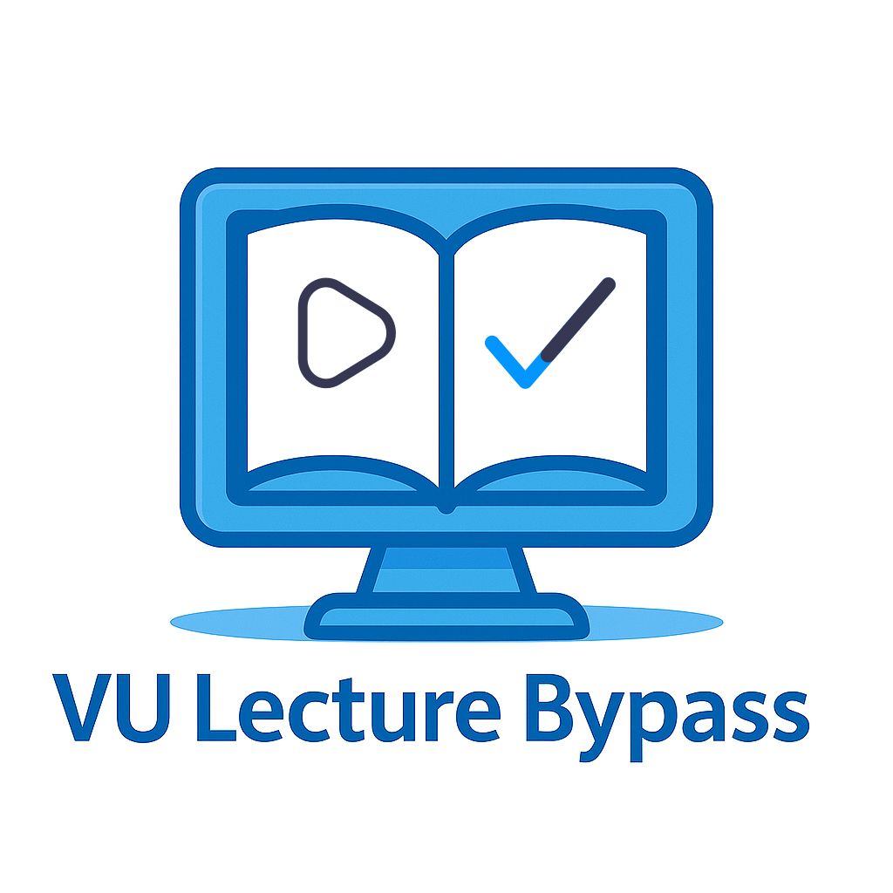

# 📚 VU LMS Lecture Bypass (Skipper)  
**“Auto-skip VU LMS lectures. Study smart, not longer.”**

A lightweight browser extension that **automatically marks VU LMS video lectures as watched** and skips to the next one — no timers, no waiting.

🎓 Built for working students, part-time learners, and anyone who values their time.

> Virtual University is designed for self-paced learning — yet students are forced to sit through long videos just to satisfy a timer.  
> This extension is for those who study on their own time — after work, during breaks, or whenever it suits them — and don’t want to waste hours just letting videos play.

---

## ✅ How It Works

- Open any **VULMS lecture tab**
- The extension **marks the lecture as watched**
- It **automatically switches to the next lecture tab**
- You don’t even need to interact with it — **install once and forget it**

🧠 Focus on learning, not watching timers tick.

---

---

## ⚡ Features

- ✅ Auto-skips VULMS video lectures after simulating a realistic view duration  
- 🌀 Auto-switches to the next lecture tab  
- 🔘 Manual **"Mark as Watched"** button  
- 💾 Remembers your preferences (auto-skip toggle)  
- 🎨 Clean popup UI with contact info  

---

## 🔧 Installation

### 🔹 Load as Unpacked Extension (Recommended)

- 📥 [**Download the latest version (ZIP)**](https://github.com/LostKnight-hz/VU-Lecture-Bypass-Skipper/releases/download/v1.6/VU_Lecture_Bypass_Skipper.zip)
- Extract the ZIP file.
- Open Chrome and visit: `chrome://extensions`
- Enable **Developer Mode** (top-right corner)
- Click **Load Unpacked** and select the extracted folder.

✅ Done! You'll see the extension icon in your Chrome toolbar.

## 📸 Screenshots

| Auto Skipping Demo | Popup UI - Main | Popup UI - Contact |
|--------------------|------------------|---------------------|
|  |  |  |

---

## 💬 Contact & Credits

Made with ❤️ by **LostKnight**

- 📧 Email: [LostKnight786@gmail.com](https://mail.google.com/mail/?view=cm&to=lostknight786@gmail.com)  
- 💬 WhatsApp: [wa.me/923058599233](https://wa.me/923058599233)

---

## 📄 License

This project is licensed under the **MIT License**.  
See [LICENSE](./LICENSE) for full details.

